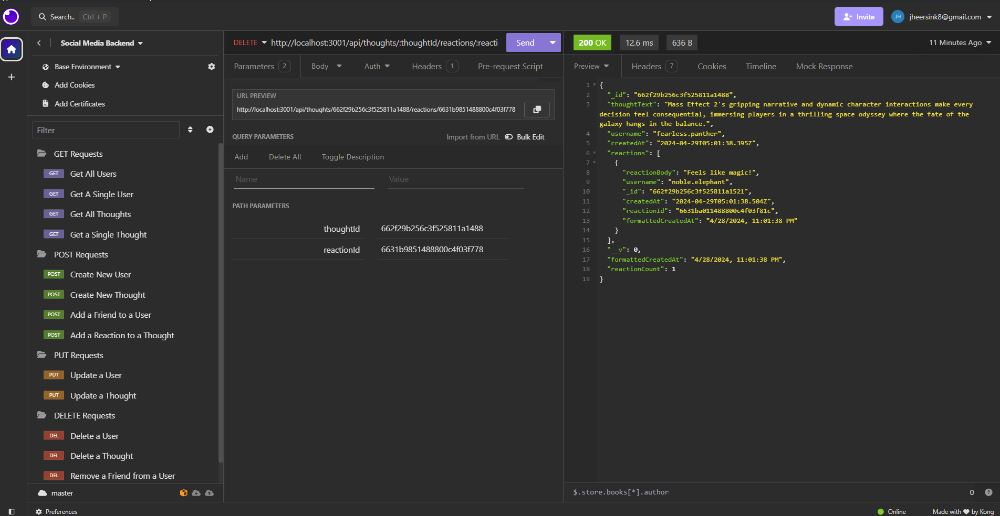

# social-media-backend

GitHub Repo: https://github.com/jheersink8/social-media-backend

Deployed Site: https://drive.google.com/file/d/12U4qYD-i8hc8TTru1GlNlYEGaza9DboZ/view 

## Description
This tool provides the database backend for a social media website. The database has the following schema:
- User (contains username, email, thoughts, and friends)
- Thought (contains thoughtText, createdAt, username, and reactions)
- Reaction (contains reactionBody, username, and createdAt) 

With these schema in place, users can add friends to their profile, create thoughts, and users can react to those thoughts. While there is no frontend for this tool, all the database functionality can be viewed through Insomnia (which is displayed in the demo video below). This tool demonstrates a working knowledge of the following tools:
- NoSQL
- MongoDB and Mongoose
- Express.js
- Node.js
- Insomnia

## Installation 
Before using this application, install all the node modules, the database, and all the seed data by following the steps below: 
1.	Open a terminal that is running from the same folder as the index.js file
2.	Run the command (with no quotes) “npm i && npm run seed && npm run start   ”

## Usage
Once the tool is invoked using the steps above, the user can view the routes using a tool like Insomnia. The routes that can be run with the JSON data (where relevant) is listed below: 
  

**GET Routes**

    All Users (http://localhost:3001/api/users/)

    A Single User (http://localhost:3001/api/users/:userId)

    All Thoughts (http://localhost:3001/api/thoughts/)

    A Single Thought (http://localhost:3001/api/thoughts/:thoughtId)

 

**POST Routes**

    Create New User (http://localhost:3001/api/users)

    Create New Thought (http://localhost:3001/api/thoughts/)

    Add a Friend to a User (http://localhost:3001/api/users/:userId/friends/:friendId)

    Add a Reaction to a Thought (http://localhost:3001/api/thoughts/:thoughtId/)

   

**PUT Routes**

    Update a User (http://localhost:3001/api/users/:userId)

    Update a Thought (http://localhost:3001/api/thoughts/:thoughtId)
  
   

**DELETE Routes**

    Delete a User (http://localhost:3001/api/users/:userId)

    Delete a Thought (http://localhost:3001/api/thoughts/:thoughtId)

    Remove a Friend from a User (http://localhost:3001/api/users/:userId/friends/:friendId)

    Remove a Reaction from a Thought (http://localhost:3001/api/thoughts/:thoughtId/reactions/:reactionId)
  
 

## Credits
- Scenario presented by Denver University in the Bootcamp course ID DU-VIRT-FSF-PT-12-2023-U-LOLC-MWTH under Module 18 Challenge. All code was written by Jordan R. Heersink.
- This tool uses Node.js, Express.js, MongoDB, and Mongoose

## License
https://opensource.org/licenses/MIT 

  Copyright (c) {{ 2024 }} {{ Jordan Heersink }}
    Permission is hereby granted, free of charge, to any person obtaining a copy
    of this software and associated documentation files (the "Software"), to deal
    in the Software without restriction, including without limitation the rights
    to use, copy, modify, merge, publish, distribute, sublicense, and/or sell
    copies of the Software, and to permit persons to whom the Software is
    furnished to do so, subject to the following conditions:
    
    The above copyright notice and this permission notice shall be included in all
    copies or substantial portions of the Software.
    
    THE SOFTWARE IS PROVIDED "AS IS", WITHOUT WARRANTY OF ANY KIND,
    EXPRESS OR IMPLIED, INCLUDING BUT NOT LIMITED TO THE WARRANTIES OF
    MERCHANTABILITY, FITNESS FOR A PARTICULAR PURPOSE AND NONINFRINGEMENT.
    IN NO EVENT SHALL THE AUTHORS OR COPYRIGHT HOLDERS BE LIABLE FOR ANY CLAIM,
    DAMAGES OR OTHER LIABILITY, WHETHER IN AN ACTION OF CONTRACT, TORT OR
    OTHERWISE, ARISING FROM, OUT OF OR IN CONNECTION WITH THE SOFTWARE OR THE USE
    OR OTHER DEALINGS IN THE SOFTWARE.